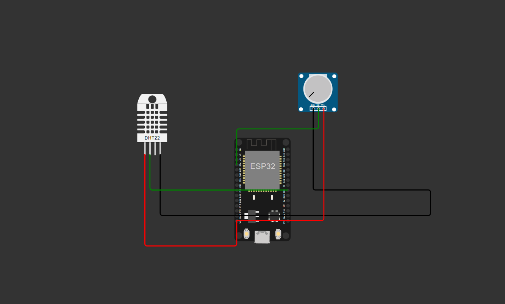
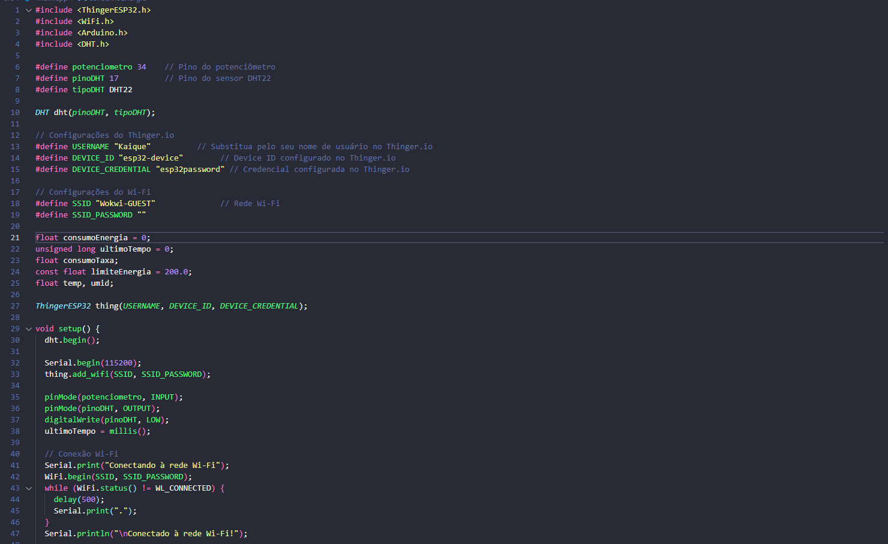

# EnergyKids - Monitoramento Inteligente de Energia e Ambiente

### Integrantes do Grupo
- Carlos - RM97528 - 2TDSPX  
- Kaique - RM551165 - 2TDSPX  
- Vinicius - RM98839 - 2TDSPX

## Introdução
O **EnergyKids** é uma solução IoT desenvolvida para monitorar o consumo de energia e as condições ambientais em tempo real, com foco na educação sustentável. Utilizando um ESP32, um potenciômetro (para simular consumo) e um sensor DHT22 (para medir temperatura e umidade), o sistema envia os dados para o painel do Thinger.io, onde podem ser visualizados de forma intuitiva.

---

## Objetivos do Projeto
- Monitorar o consumo de energia de forma prática e educativa.
- Exibir as condições ambientais (temperatura e umidade) em tempo real.
- Promover a conscientização sobre o uso eficiente de recursos naturais.

---

## Arquitetura do Sistema

### **Hardware**
- **ESP32**: Controlador principal para leitura dos sensores e envio de dados.
- **Potenciômetro**: Simula o consumo de energia elétrica.
- **DHT22**: Mede temperatura e umidade do ambiente.

### **Software**
- **Thinger.io**: Plataforma IoT utilizada para visualização dos dados.
- **Wokwi**: Ferramenta de simulação para testes do circuito e do código.

---

## Funcionalidades
1. **Consumo de Energia**:
   - Simulação do consumo em tempo real usando um potenciômetro.
   - Cálculo do consumo acumulado exibido no painel do Thinger.io.

2. **Condições Ambientais**:
   - Monitoramento da temperatura e umidade com o DHT22.
   - Exibição em tempo real no painel do Thinger.io.

3. **Educação Sustentável**:
   - Interface intuitiva para ensino de conceitos de eficiência energética e sustentabilidade.

---

## Como Reproduzir a Solução

### **1. Requisitos**
- **Hardware**:
  - ESP32
  - Potenciômetro
  - DHT22
- **Software**:
  - Conta no [Thinger.io](https://console.thinger.io/)
  - Simulador [Wokwi](https://wokwi.com/)

---

### **2. Montagem do Circuito**
- Conecte os componentes conforme o diagrama:
  - **Potenciômetro**:
    - Pino central ao **pino 34** do ESP32.
    - Outras extremidades ao **VCC** e **GND**.
  - **DHT22**:
    - VCC ao **3.3V**, GND ao **GND**.
    - Pino de dados ao **pino 17** do ESP32.

---

### **3. Código-Fonte**
O código completo foi implementado no ESP32 e está disponível abaixo:

---

### **4. Configuração do Thinger.io**
1. Crie uma conta no [Thinger.io](https://console.thinger.io/).
2. Adicione um dispositivo:
   - **Device ID**: `esp32-device`
   - **Device Credentials**: `esp32password`
3. Acesse o painel e veja os dados nos recursos:
   - `Consumo de Energia`
   - `Temperatura`
   - `Umidade`

---

### **5. Funcionamento**
- Ajuste o potenciômetro para simular o consumo de energia.
- Monitore os valores de temperatura e umidade em tempo real.
- Acesse o painel do Thinger.io para visualizar os dados.

---

## Benefícios do Projeto
1. **Educação Sustentável**: Promove a conscientização sobre o uso eficiente de energia e recursos naturais.
2. **Fácil Integração**: Simples de montar e integrar com plataformas IoT.
3. **Interface Intuitiva**: Dados claros e em tempo real, ideais para fins educacionais.

---

## Imagens e Diagramas
- **Logo da Empresa**:
  

- **Diagrama do Circuito**:
  

- **Imagem do Código**:
  

---

